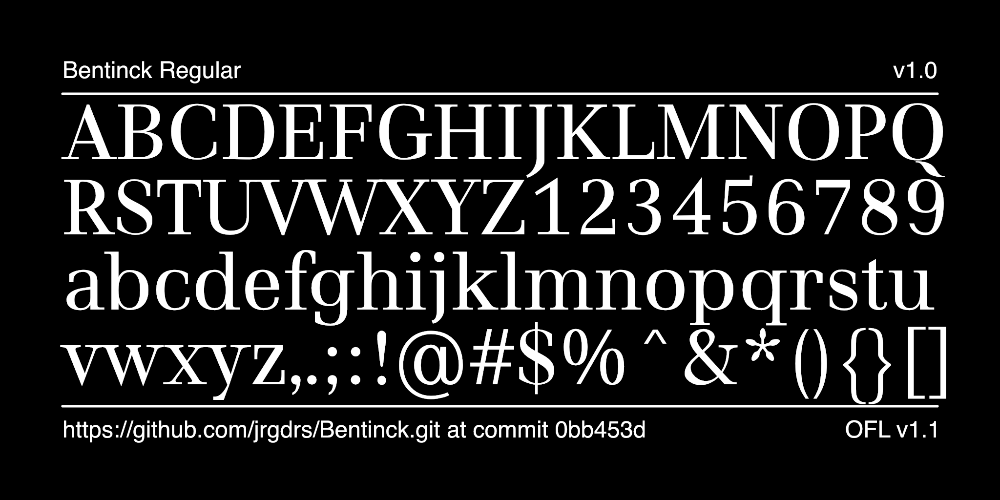

# Bentinck Font Project

[![][Fontbakery]](https://jrgdrs.github.io/Bentinck/fontbakery/fontbakery-report.html)
[![][Universal]](https://jrgdrs.github.io/Bentinck/fontbakery/fontbakery-report.html)
[![][GF Profile]](https://jrgdrs.github.io/Bentinck/fontbakery/fontbakery-report.html)
[![][Outline Correctness]](https://jrgdrs.github.io/Bentinck/fontbakery/fontbakery-report.html)
[![][Shaping]](https://jrgdrs.github.io/Wittgenstein/Bentinck/fontbakery-report.html)

[Fontbakery]: https://img.shields.io/endpoint?url=https%3A%2F%2Fraw.githubusercontent.com%2Fjrgdrs%2FBentinck%2Fgh-pages%2Fbadges%2Foverall.json
[GF Profile]: https://img.shields.io/endpoint?url=https%3A%2F%2Fraw.githubusercontent.com%2Fjrgdrs%2FBentinck%2Fgh-pages%2Fbadges%2FGoogleFonts.json
[Outline Correctness]: https://img.shields.io/endpoint?url=https%3A%2F%2Fraw.githubusercontent.com%2Fjrgdrs%2FBentinck%2Fgh-pages%2Fbadges%2FOutlineCorrectnessChecks.json
[Shaping]: https://img.shields.io/endpoint?url=https%3A%2F%2Fraw.githubusercontent.com%2Fjrgdrs%2FBentinck%2Fgh-pages%2Fbadges%2FShapingChecks.json
[Universal]: https://img.shields.io/endpoint?url=https%3A%2F%2Fraw.githubusercontent.com%2Fjrgdrs%2FBentinck%2Fgh-pages%2Fbadges%2FUniversal.json

The font interprets a didone in soft and restrained shapes. There is only a regular versionvavailable.

Find specimen and language samples as pdf file in subfolder documentation.

## License

This Font Software is licensed under the SIL Open Font License, Version 1.1.
This license is available with a FAQ at
https://scripts.sil.org/OFL

## Repository Layout

This font repository structure is inspired by [Unified Font Repository v0.3](https://github.com/unified-font-repository/Unified-Font-Repository), modified for the Google Fonts workflow.
